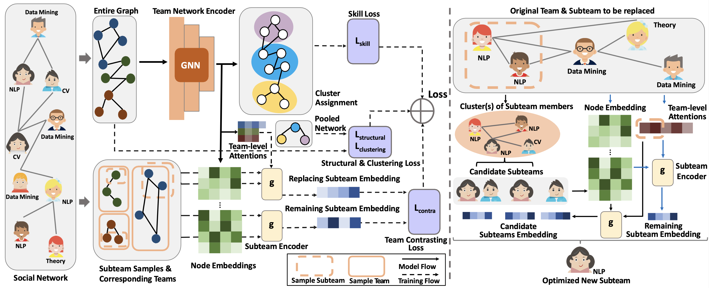

# GENIUS

This repository contains the code for the following paper,

**[GENIUS: Subteam Replacement with Clustering-based Graph Neural Networks (SDM'24)](https://epubs.siam.org/doi/abs/10.1137/1.9781611978032.2)** 
*Chuxuan Hu, Qinghai Zhou, and Hanghang Tong*

In this paper, we introduce GENIUS, a clustering-based graph neural network (GNN) framework that (1) captures team social network knowledge for *subteam replacement* by deploying team-level attention GNNs (*TAGs*) and self-supervised *positive team contrasting* training scheme, (2) generates unsupervised team social network member clusters to prune candidates for fast computation, and (3) incorporates a *subteam recommender* that selects new subteams of flexible sizes.
We demonstrate the efficacy of the proposed method in terms of (1) *effectiveness*: being able to select better subteam members that significantly increase the similarity between the new and original teams, and (2) *efficiency*: achieving more than 600 times speed-up in average running time.
Please refer to our paper for more details.

### File Descriptions
`genius.py` : Implementation for the entire GENIUS framework, including the team encoder, subteam recommender, and the training schema.

`tag.py` : Implementation for the team encoder with the Team-level Attention GNNs (*TAGs*)

`evaluation.py` : The evaluation code using 3 different graph similarity metrics as mentioned in Section 4.1.

`dblp.py`: Code for loading data using the DBLP dataset as an example.
